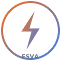

<p align="center">
  
</p>

<h1 align="center">ESVA — Electrical Search Vertical AI</h1>

<p align="center">
  <strong>The Engineer's Search Engine</strong> — AI-powered electrical engineering vertical search & verification platform
</p>

<p align="center">
  <a href="https://github.com/gilheumpark-bit/ESA/actions"></a>
  <a href="https://github.com/gilheumpark-bit/ESA/blob/main/LICENSE"></a>
  
  
  
  
  
</p>

<p align="center">
  <a href="#features">Features</a> •
  <a href="#architecture">Architecture</a> •
  <a href="#getting-started">Getting Started</a> •
  <a href="#tech-stack">Tech Stack</a> •
  <a href="#testing">Testing</a> •
  <a href="#api">API</a> •
  <a href="#roadmap">Roadmap</a> •
  <a href="#contributing">Contributing</a> •
  <a href="#license">License</a>
</p>

---

## Overview

ESVA is a professional electrical engineering platform that combines multi-model LLM search with deterministic engineering calculators, 4-team agent verification, and transparent receipt system. Built for licensed electrical engineers, designers, and students.

> **Status:** Open Beta (v0.2.0) — Free to use with BYOK (Bring Your Own Key)

### Key Value Propositions

- **Multi-Standard Search** — KEC (160+), NEC (42), IEC (25), JIS (18) = 245+ articles with condition-tree DSL
- **56+ Validated Calculators** — Voltage drop, cable sizing, arc flash, short-circuit, grounding, solar PV, and more (±0.01% accuracy)
- **4-Team Agent System** — SLD/Layout/Standards/Consensus with debate protocol and 8 physics-law validations
- **Receipt Transparency** — Every AI response comes with a verifiable receipt (SHA-256 hash, date-stamped, model-tracked)
- **BYOK (Bring Your Own Key)** — Users supply their own LLM API keys; ESVA never stores keys server-side

---

## Features

### AI-Powered Search
- Multi-model LLM support: Google Gemini 2.5, OpenAI GPT-4.1, Anthropic Claude 4, Groq Llama 4, Mistral, Ollama
- 7-language keyword extraction (KR/EN/JP/ZH/DE/FR/ES)
- EngRank scoring algorithm with transparent ranking reasoning
- Vector search via Weaviate with local fallback

### Engineering Calculators (56+)

| Category | Examples |
|----------|---------|
| Power | Voltage drop (1ph/3ph), power factor correction, demand/diversity factor, power loss |
| Protection | Short-circuit (IEC 60909), arc flash (IEEE 1584), breaker sizing, RCD, relay |
| Wiring | Cable sizing (KEC/NEC/IEC), conduit fill, ampacity derating, AWG converter |
| Grounding | Ground resistance (Dwight), equipotential bonding, lightning protection |
| Solar/ESS | PV generation, battery capacity, grid connect, PCS sizing, solar cable |
| Transformer | Capacity, loss, efficiency, impedance, inrush, parallel operation |
| Lighting | Illuminance (KS C 7612), energy saving, emergency generator, UPS |
| Motor | Capacity, starting current, efficiency (IE1-4), braking resistor, VFD |
| Substation | CT/VT sizing, surge arrester, MV switchgear |

All calculators: pure functions, sandboxed, no side effects, uncertainty range tracking.

### Standards Compliance (245+ articles)

| Standard | Articles | Coverage |
|----------|----------|----------|
| **KEC 2021** | 160+ | 55 core + 100+ extended, 8 individual evaluators |
| **NEC 2023** | 42 | Full cross-references to KEC/IEC/JIS equivalents |
| **IEC 60364** | 25 | 6th edition + Amendment, 20 cross-references |
| **JIS C 0364** | 18 | A/B/C/D grounding, seismic, medical, EV |

- Condition-tree DSL with AND/OR composite conditions
- Generic evaluator for 97% of articles + 8 specialized evaluators
- Ampacity tables: KEC (456 values), NEC (162 values), IEC (200+ values)

### 4-Team Agent Architecture

```
Input → Orchestrator → ┬─ TEAM-SLD (계통도 분석)
         (retry 2x)    ├─ TEAM-LAYOUT (평면도 분석)
                        ├─ TEAM-STD (규정 질의)
                        └─ TEAM-CONSENSUS (합의 + 보고서)
```

- 8 physics-law validations (V=IR, P=VI, I²R, Z=√R²+X², VD%, Q=Ptanφ, S=P/cosφ, E=Pt)
- Max 3-round debate with 2/3 consensus or conservative adoption
- HITL escalation on consensus failure
- Exponential backoff retry on team dispatch failure

### Vision Pipeline
- DXF/PDF vector parsing for electrical drawings
- VRAM-split parallel vision (N×N grid with PNG/JPEG header parsing)
- 150+ electrical symbol database (CAD block name → standard type)
- VLM integration: Gemini 2.5 Flash / GPT-4.1 Vision with retry + key validation

### Safety & Verification
- 9 guardrail blocking rules + 11 system prompt rules
- 17 prompt injection detection patterns (EN + KO)
- `sanitizeInput()` on all user-facing API inputs
- AES-GCM encryption for BYOK keys (session-scoped)
- Rate limiting with 9 profiles (sliding window)
- PE-grade disclaimers on all safety-critical calculations

### Professional Output
- ESVA Verified badge with IDE-style red/yellow/green markings
- Engineering Review Report (Issue Analysis → Applicable Codes → Technical Verification → Conclusion → Pending RFI)
- Receipt with SHA-256 hash and optional IPFS pinning
- Excel export (ExcelJS, 2-sheet with formatting + formulas)

---

## Architecture

```
┌──────────────────────────────────────────────────────┐
│                    Next.js 16 App                    │
│               (19 pages, 31 API routes)              │
├──────────────────────────────────────────────────────┤
│  Agent Layer                                         │
│  ┌───────────┐  ┌───────────┐  ┌──────────────────┐ │
│  │Orchestr.  │  │ Legacy    │  │ Vision Pipeline  │ │
│  │(4-Team)   │  │(Main/     │  │ (DXF/PDF/VLM)    │ │
│  │+ Retry    │  │Bridge/    │  │ + PNG/JPEG parse  │ │
│  │SLD/LAY/   │  │Sandbox)   │  │ 150+ symbols     │ │
│  │STD/CON    │  │17 sbox    │  │ Gemini/GPT-4V    │ │
│  └───────────┘  └───────────┘  └──────────────────┘ │
├──────────────────────────────────────────────────────┤
│  Engine Layer                                        │
│  ┌────────┐ ┌──────────┐ ┌────────┐ ┌────────────┐ │
│  │Calc(56)│ │Std(245)  │ │Topology│ │Receipt     │ │
│  │±0.01%  │ │KEC/NEC/  │ │BFS     │ │SHA-256     │ │
│  │uncert. │ │IEC/JIS   │ │Graph   │ │IPFS        │ │
│  │range   │ │AND/OR DSL│ │Cache   │ │            │ │
│  └────────┘ └──────────┘ └────────┘ └────────────┘ │
├──────────────────────────────────────────────────────┤
│  Data Layer                                          │
│  250+ IEC terms │ 200+ synonyms │ 170+ constants    │
│  KEC/NEC/IEC    │ 56 material   │ 11 drawing        │
│  ampacity tables│ prices        │ templates          │
└──────────────────────────────────────────────────────┘
```

> See [ARCHITECTURE.md](ARCHITECTURE.md) for detailed system design.

---

## Getting Started

### Prerequisites

- Node.js 20+ (see `.nvmrc`)
- npm 10+

### Installation

```bash
git clone https://github.com/gilheumpark-bit/ESA.git
cd ESA
npm install
```

### Environment Variables

Create a `.env.local` file:

```env
# Firebase Auth
NEXT_PUBLIC_FIREBASE_API_KEY=
NEXT_PUBLIC_FIREBASE_AUTH_DOMAIN=
NEXT_PUBLIC_FIREBASE_PROJECT_ID=

# Supabase
NEXT_PUBLIC_SUPABASE_URL=
NEXT_PUBLIC_SUPABASE_ANON_KEY=

# Stripe (optional)
STRIPE_SECRET_KEY=
NEXT_PUBLIC_STRIPE_PUBLISHABLE_KEY=

# AI Providers (optional — users can supply their own via BYOK)
GOOGLE_AI_API_KEY=
OPENAI_API_KEY=
ANTHROPIC_API_KEY=

# Weaviate Vector DB (optional — local fallback available)
WEAVIATE_URL=
WEAVIATE_API_KEY=
```

> All AI provider keys are optional. ESVA works with BYOK — users can register their own keys in Settings.

### Development

```bash
npm run dev          # Start dev server (Turbopack)
npm run build        # Production build
npm run lint         # ESLint
npm test             # All tests (22 suites, 336 tests)
npm run test:calc    # Calculator accuracy tests only
npm run test:watch   # Watch mode
```

---

## Tech Stack

| Layer | Technology |
|-------|-----------|
| Framework | Next.js 16 (App Router, Turbopack) |
| Language | TypeScript (strict mode) |
| Styling | Tailwind CSS 4 |
| Auth | Firebase Auth |
| Database | Supabase (PostgreSQL + Edge Functions) |
| Payments | Stripe |
| AI SDK | Vercel AI SDK (multi-provider) |
| State | Zustand + React Query |
| Vector DB | Weaviate (+ local fallback) |
| Testing | Jest 30 + Playwright |
| Deploy | Vercel |

### AI Models Supported (2026-Q2)

| Provider | Models |
|----------|--------|
| Google | Gemini 2.5 Pro, 2.5 Flash, 2.5 Flash Lite |
| OpenAI | GPT-4.1, 4.1 Mini, 4.1 Nano, o4-mini |
| Anthropic | Claude Opus 4, Sonnet 4, Haiku 4.5 |
| Groq | Llama 4 Maverick/Scout, Llama 3.3 70B |
| Mistral | Large, Small, Codestral |
| Ollama | Llama 4, Gemma 3, Qwen 3, Mistral Small 3.1 |

---

## Testing

22 test suites / 336 tests. Calculator tests enforce **±0.01% accuracy** against reference values.

| Category | Suites | Tests | Coverage |
|----------|--------|-------|----------|
| Calculators | 9 | ~120 | VD, cable, short-circuit, transformer, grounding, solar, power, arc flash, unit conversion |
| Standards | 4 | ~40 | KEC DSL boundary, NEC articles, IEC articles, debate protocol |
| LLM | 4 | ~50 | Intent parser, output filter, judge, source tracker |
| Lib/Search | 4 | ~60 | Rate limit, safety policies (16 injection tests), API helpers, query parser |
| Agent | 1 | ~10 | Orchestrator, classification, routing |
| E2E | 1 | 28 | Pages, API, responsive, accessibility (Playwright) |

---

## API

### Self-Documenting

```
GET /api/openapi     # OpenAPI 3.1 schema (auto-generated)
GET /api/health      # Dependency health dashboard
```

### Response Shape (all routes)

```json
{ "success": true, "data": { ... } }
```
```json
{ "success": false, "error": { "code": "ESA-3001", "message": "..." } }
```

### Error Code Ranges

| Range | Category |
|-------|----------|
| ESA-1xxx | Auth/Permission |
| ESA-2xxx | Plan/Limit |
| ESA-3xxx | Search |
| ESA-4xxx | Calculation |
| ESA-5xxx | Export |
| ESA-6xxx | External Services |
| ESA-7xxx | Standard Conversion |
| ESA-9xxx | System |

### Performance Headers
- `X-Response-Time`, `Server-Timing` on all responses

---

## Roadmap

| Phase | Target | Status |
|-------|--------|--------|
| v0.1.0 | Core platform (56 calc, 211 articles, 4-team agent) | ✅ Complete |
| v0.2.0 | Quality upgrade (IEC tables, DSL AND/OR, retry, accessibility) | ✅ Complete |
| v0.3.0 | Fine-tuned model (Qwen 3 32B + KEC LoRA) | Planned |
| v0.4.0 | Dynamic simulation (transient, harmonics) | Planned |
| v0.5.0 | Protection coordination TCC overlay | Planned |
| v1.0.0 | Production release + SaaS billing | Planned |

---

## Project Structure

```
src/
├── app/                    # Next.js App Router (19 pages, 31 API routes)
├── agent/                  # 4-Team agent + debate + vision + 17 sandboxes
├── engine/
│   ├── calculators/        # 56+ pure-function calculators
│   ├── standards/          # KEC/NEC/IEC/JIS condition-tree DSL (245+ articles)
│   ├── constants/          # 170+ electrical constants + calc thresholds
│   ├── conversion/         # Metric↔Imperial adapter + unit conversion
│   ├── verification/       # Audit engine + quality checklist + sensitivity
│   ├── topology/           # BFS graph + DXF/PDF parsers
│   ├── receipt/            # Receipt generator + SHA-256
│   └── llm/                # 22 LLM tools + system prompts
├── data/                   # 250+ IEC terms, 200+ synonyms, ampacity tables, prices
├── components/             # React components (30+)
├── lib/                    # Security, rate limit, cache, embedding, AI providers
└── services/               # Server-side AI streaming providers
```

---

## Documentation

| Document | Description |
|----------|-------------|
| [README.md](README.md) | This file — overview and setup |
| [ARCHITECTURE.md](ARCHITECTURE.md) | Detailed system architecture |
| [CONTRIBUTING.md](CONTRIBUTING.md) | Development guidelines and conventions |
| [CHANGELOG.md](CHANGELOG.md) | Version history (v0.1.0, v0.2.0) |
| [EVALUATION_GUIDE.md](EVALUATION_GUIDE.md) | 10-category evaluation rubric for external review |
| [CODE_OF_CONDUCT.md](CODE_OF_CONDUCT.md) | Contributor Covenant 2.1 |
| [SECURITY.md](.github/SECURITY.md) | Vulnerability reporting + security measures |
| [LICENSE](LICENSE) | MIT License |

---

## Contributing

See [CONTRIBUTING.md](CONTRIBUTING.md) for development guidelines, branch strategy, code conventions, and PR process.

---

## License

MIT License — see [LICENSE](LICENSE) for details.

---

<p align="center">
  Built for electrical engineers, by engineers.<br/>
  <strong>ESVA</strong> — The Engineer's Search Engine
</p>
