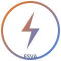

<p align="center">
  
</p>

# ESVA

ESVA(Electrical Search Vertical AI)는 예비 직무자부터 숙련 전기 직무자까지 질문, 계산, 기준서 탐색, 도면 검토를 한 작업 흐름에서 처리하도록 만든 웹 애플리케이션입니다. AI가 가능한 분석과 기술 판단을 먼저 제시해 반복 확인 부담을 줄이고, 계산식·입력·도면 근거·결론 변경 조건을 다시 추적할 수 있게 하는 것이 목적입니다.

현재 저장소 버전은 `0.2.0`입니다. 공개·합성 교보재를 사용한 내부 검증 단계이며, 설계 승인 도구나 법적 적합성 인증서가 아닙니다. 운영 데이터베이스, 결제, 외부 AI 품질은 배포 환경에서 별도로 검증해야 합니다.

## 현재 제공 범위

| 영역 | 상태 | 확인해야 할 경계 |
|---|---|---|
| 결정론적 계산기 | 사용 가능 | 계산기 레지스트리의 입력 계약과 기준값 테스트를 사용합니다. 모든 계산기에 하나의 공통 정확도 수치를 적용하지 않습니다. |
| AI 질문·답변 | 조건부 사용 가능 | 서버 키, BYOK, 허용된 온프레미스 모델 또는 같은 PC의 ChatGPT/Codex 로그인을 사용할 수 있습니다. 완전한 계산 질문은 AI가 임의 계산하지 않고 ESVA 계산기를 먼저 실행합니다. |
| 기준서 탐색·판정 | 사용 가능, 일부 HOLD | 저장소에 포함된 판본 스냅샷을 검색합니다. 공인 원문 최신 개정 자동 동기화가 아닙니다. |
| 이미지·DXF·PDF 도면 분석 | 조건부 사용 가능 | 벡터 파서와 역할별 이미지 분석을 구분합니다. 저해상도, 스캔 PDF, 커스텀 CAD 블록, 불완전한 결선은 HOLD가 될 수 있습니다. |
| SLD 전체 문서 판독 | 사용 가능 | 전체 페이지와 구획을 분석한 뒤 경계선 `C`, 미확정 끝점 `U`를 추적하고 전체 그래프에서 중복을 제거합니다. 외부 독립 라벨 기준 95% 달성은 아직 주장하지 않습니다. |
| 보고서·영수증 | 사용 가능 | 입력, 결과, 근거와 SHA-256 무결성 정보를 기록합니다. 일반 영수증 해시는 제3자 공증이나 법적 서명이 아닙니다. |
| 프로젝트·공유·커뮤니티·현장 기록 | 배포 환경 의존 | Firebase 인증과 Supabase 스키마가 필요합니다. |
| 결제·구독 | 운영 전 검증 필요 | Stripe 테스트 모드의 Checkout, 서명 웹훅, 티어 반영, 새 세션 조회까지 닫혀야 합니다. |
| 이메일·푸시, IPFS 타임스탬프 | 비활성 또는 휴면 | 인앱 기록과 설정만으로 발송·공증을 주장하지 않습니다. |

## AI가 계산을 처리하는 방식

완전한 계산 질문은 다음 순서로 처리됩니다.

```text
사용자 질문
  → 계산 의도와 필수 입력 확인
  → ESVA 계산기 레지스트리 실행
  → 입력·공식·결과 영수증 생성
  → 영수증을 AI 모델에 전달
  → 영수증과 답변을 화면에 표시
```

필수 입력이 없거나 파서 확신도가 낮으면 계산기를 실행하지 않습니다. 이때 AI는 역질문으로 판단을 넘기지 않고 현재 근거의 조건부 결론과 `결론을 바꾸는 핵심 입력`을 선언형으로 제시한 뒤 나머지 설명을 계속합니다. 모델이 이를 어겨 판단을 사용자에게 되넘기면 같은 공급자·모델로 한 번만 교정하며, 교정도 실패하면 원답을 숨기고 `판단 미완결`로 닫습니다. 임의 수치로 적합 판정을 만들지는 않습니다. `npm run gate:chat-live`는 production 서버에서 전압강하 계산을 실제 실행하고, 같은 영수증이 모델 입력과 사용자 응답에 전달되는지 검사합니다.

## 도면 분석 범위

검증 자료는 회사 기밀 도면이 아니라 저장소에 출처를 기록한 공개 PDF·이미지와 비민감 합성 DXF입니다. 현재 목표는 이 교보재 수준의 단선도·평면도에서 기호, 문자, 연결선, 상하류 관계, 수량과 누락 후보를 빠짐없이 구조화하는 것입니다.

도면 판독은 다음 순서로 진행됩니다.

1. 파일 형식과 전체 페이지를 열거합니다.
2. 전체 이미지를 기호, 문자, 연결, 논리 역할이 각각 먼저 판독합니다.
3. 저확신·복수 후보·고밀도 위치에 필요한 정밀 구획만 역할별로 확대 판독합니다.
4. 구획 결과를 원본 좌표로 되돌리고 경계 선과 미확정 끝점에 추적 번호를 부여합니다.
5. 전체 도면 그래프로 다시 조립해 중복과 오병합을 제거하고, 조립 결과를 별도 감사합니다.
6. 미확정 항목은 완료된 역할을 보존한 채 해당 역할·위치만 재검사합니다.
7. 입력 근거가 완전할 때만 정본 계산기를 실행하고 확인·추정·미확인 항목을 보고서로 냅니다.

미확정 항목도 사용자에게 판정을 되묻지 않습니다. ESA가 가장 근거가 강한 후보를 `ESA 잠정 판독`으로 제시하고, 그 항목만 안전 계산·확정 관계에서 보류하며 나머지 분석은 유지합니다. 화면과 CSV·인쇄 보고서는 `ESA 판단`, `권장 조치`, `결론 변경 조건`을 함께 냅니다.

2026-08-03 공개 교보재의 최신 고밀도 실호출에서 MCC는 202.5초·55회 모델 호출로 136기호·223선·212문자·176관계를 회수했고, 현재 결정론 보정 재생은 FAIL 없이 HOLD로 끝났습니다. 북미 반복 분기 도면은 같은 실호출 봉투의 재조립에서 변압기 10/10·버스 4/4·부하 21/21을 회수했지만 관계 대부분이 추론 상태입니다. 이는 파이프라인 수리 증거이지 독립 라벨 기반 80%·95% 정확도 인증이 아닙니다.

KEC 자동 검토는 근거가 완결된 212.5 차단용량 비교와 212.7.2의 별도 과부하·단락 보호장치 에너지 협조를 포함합니다. 일반적인 상·하위 차단기 시간-전류 선택협조는 자동 판정 범위가 아니며 필요한 입력이 없으면 HOLD합니다.

교보재와 재실행 명령은 [실증 증거 원장](docs/VALIDATION_EVIDENCE.md), 현재 한계는 [도면 검증 결과](docs/DRAWING_VALIDATION_RESULT.md)에 기록합니다.

## 로컬 실행

요구 사항은 Node.js 22.13 이상과 npm입니다. ChatGPT 계정 연결을 사용할 때는 같은 PC에
Codex 데스크톱 앱 또는 CLI가 설치되고 공식 ChatGPT 로그인이 완료돼 있어야 합니다.
외부 AI, 인증, 저장, 결제 기능은 해당 서비스 설정이 있을 때만 작동합니다.

```bash
git clone https://github.com/gilheumpark-bit/ESA.git
cd ESA
npm ci
cp .env.example .env.local
npm run dev
```

Windows PowerShell에서는 환경 파일을 다음과 같이 복사합니다.

```powershell
Copy-Item .env.example .env.local
npm run dev
```

브라우저에서 `http://localhost:3000`을 엽니다. 비밀값은 `.env.local`에만 넣고 Git에 커밋하지 마십시오.

### 회사 구성원이 자기 ChatGPT 계정으로 시험하기

1. ESA와 Codex를 같은 PC에서 실행하고 Codex에 자신의 ChatGPT 계정으로 로그인합니다.
2. ESA의 **설정 → AI 연결 관리 → ChatGPT 계정**으로 이동합니다.
3. 계정 상태를 확인하고 사용할 모델을 고른 뒤 **이 계정 사용**을 누릅니다.
4. 홈·검색·Studio의 AI 답변과 이미지 SLD·OCR·전문팀 검토가 해당 로컬 계정을 우선 사용합니다.

이 방식에는 OpenAI Platform API 키가 필요하지 않습니다. ESA는 ChatGPT 비밀번호,
쿠키, access token, refresh token을 읽거나 저장하지 않고 로컬 Codex 프로세스에
추론만 요청합니다. 계정 플랜의 모델·사용량 제한은 그대로 적용됩니다.

이 연결은 `localhost`, `127.0.0.1`, `[::1]`에서 연 ESA에만 제공됩니다. 인터넷에
배포한 ESA가 사용자 PC의 ChatGPT 세션을 원격으로 사용하는 연결 도우미는 아직
구현하지 않았습니다.

도면 시험에는 모델 목록에서 `이미지`가 표시된 상위 모델을 권장합니다. 2026-07-31
공개 `wiki-oneline.png` 교보재 실측에서 `gpt-5.6-terra`는 기기 17개·연결 16개를
반환하며 완료됐고, `gpt-5.4-mini`는 같은 SLD 요청의 120초 제한을 넘었습니다.
이 기록은 연결·완주 확인이며 도면 정답률 보증이 아닙니다.

연결된 개인 계정으로 비민감 텍스트와 공개 이미지 1건을 실제 호출하는 로컬 게이트는
`npm run gate:chatgpt-local-live`입니다. 계정 사용량을 소비하므로 자동 CI에는 넣지
않습니다.

### 로컬 Claude 계정 (`claude-local`)

같은 방식으로 이 PC에 로그인된 `claude` CLI 를 도면 판독에 쓸 수 있습니다. Anthropic
API 키가 필요하지 않습니다. 프롬프트는 stdin 으로만 전달하고, 이미지는 격리 임시
폴더에 두고 `--allowedTools=Read` 로 좁히며, 계정 상태는 토큰을 쓰지 않는
`claude auth status --json` 으로만 확인합니다. ChatGPT 연결과 마찬가지로 루프백에서
연 ESA 에만 제공됩니다.

라이브 게이트는 `npm run gate:claude-local-live` 입니다. 계정 사용량을 소비하므로
자동 CI 에는 넣지 않습니다.

## 검증

```bash
npm run check:docs
npx tsc --noEmit --incremental false
npm run lint -- --max-warnings=0
npm test -- --runInBand
npm run build
npm run gate:pdf
npm run gate:chat-live
```

도면 V3 계약과 외부 95% 주장 게이트는 목적이 다릅니다.

```bash
npm run gate:sld-v3-contract
npm run test:sld-benchmark
npm run gate:sld-golden
```

도면 조립기의 회귀는 라벨 점수만으로는 잡히지 않습니다(고급 도면에서는 같은 코드로도
회차 간 폭이 큽니다). 정답 라벨 없이 조립 품질을 재는 보조 자를 함께 씁니다.

```bash
npm run test:scripts
node scripts/measure-assembly-quality.mjs <DRAWING_JOB_STORE_DIR>
```

`gate:sld-golden`은 승인된 독립 라벨, 예측, 서명 키가 없으면 의도적으로 실패합니다. 실패를 구현 회귀와 95% 주장 자격 부족으로 구분해 영수증을 확인해야 합니다.

## 저장소 구조

```text
src/app/                  사용자 페이지와 API 진입점
src/engine/calculators/   결정론적 계산기와 입력 계약
src/engine/standards/     기준서 스냅샷과 판정기
src/engine/topology/      DXF·PDF 벡터와 연결 그래프
src/agent/                도면 역할 심사, 전기 합성, 합의, 보고서
src/lib/                  AI 공급자, 인증, 저장, 보안, 내보내기
supabase/migrations/      PostgreSQL·RLS·결제·보고서 계약
fixtures/                 합성·공개 교보재와 독립 라벨
docs/                     사용자, 검증, 구조, 인수인계 문서
```

구조와 신뢰 경계는 [ARCHITECTURE.md](ARCHITECTURE.md), 문서별 정본 여부와 읽는 순서는 [문서 지도](docs/README.md)를 참조하십시오.

## 배포 전 확인

- Supabase 마이그레이션 파일의 존재는 대상 DB 적용 완료를 뜻하지 않습니다.
- 인메모리 레이트 리밋은 단일 프로세스 보호 장치입니다.
- 기준서 판정은 관할 기관의 현행 원문 확인을 대체하지 않습니다.
- 실제 외부 모델 품질은 공급자, 모델, 도면, 반복 실행별로 따로 평가해야 합니다.
- SLD `verified95`는 승인된 외부 평가 영수증이 없으면 항상 비활성입니다.

## 문서와 라이선스

- 사용자 절차: [docs/USER_GUIDE.md](docs/USER_GUIDE.md)
- API 계약: [docs/API_REFERENCE.md](docs/API_REFERENCE.md), `GET /api/openapi`
- 현재 구현 상태: [PROJECT_STATE.md](PROJECT_STATE.md)
- 기여 절차: [CONTRIBUTING.md](CONTRIBUTING.md)
- 보안 정책: [SECURITY.md](SECURITY.md)

라이선스는 [CC BY-NC 4.0](LICENSE)입니다. 상업적 사용에는 별도 허가가 필요합니다.
