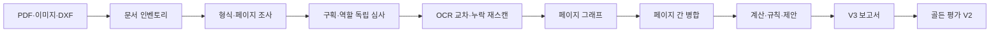

# ESA 도면 완전 판독·제안·95% 실증 상세 설계

- 상태: **구현 정본 (implementation criteria)** · **I 단계 1차 배선 완료 (2026-07-21)**
- 기준일: 2026-07-21
- 대상: ESA 도면 분석 경로 (PDF·이미지·DXF)
- 목표 단계: D 설계 → I 구현 → X 통합 → V 실증
- [근거] E1 실측 · 축=도면 판독 완결성·현장 활용성 · 기준선=`e29ced9` 코드 / `3c5b14c` 문서
- 상위 게이트·수치 계약: `2026-07-20-sld-95-drawing-intelligence-design.md` (상위 AC-01~11)
- 본 문서 전용 수용 기준: §14 `FR-AC-01`~`FR-AC-15` (본문 AC 표기와 동일 번호)
- 핵심 결정: **독립 심사형 다중 호출 + 결정론적 합산**. 한 번의 거대 Vision 호출이나 여러 공급자의 다수결만으로 최종 판정을 만들지 않는다.

### 구현 위치 (코드)

| 설계 | 경로 |
|---|---|
| V3 계약 | `src/agent/drawing/types-v3.ts` |
| evidence / variants / regions | `src/agent/vision/evidence-types.ts`, `image-quality.ts`, `image-variants.ts`, `adaptive-regions.ts` |
| OCR·수량·커버리지·교차페이지·제안 | `src/agent/drawing/ocr-adjudicator.ts`, `count-register.ts`, `coverage-ledger.ts`, `cross-page-graph.ts`, `recommendation-engine.ts` |
| 오케스트레이터·잡스토어·리스 | `document-orchestrator.ts`, `drawing-job-store.ts`, `source-lease-store.ts` |
| 역할 분리 | `role-prompts.ts`, `role-runner.ts` |
| V3 보고서·평가 V2·벤치 | `drawing-document-report.ts`, `sld-evaluator-v2.ts`, `sld-benchmark-runner.ts` |
| API | `POST/GET /api/drawing-jobs`, `POST /api/drawing-jobs/[jobId]/corrections` |
| UI | `DrawingIntelligenceReport.tsx`, `DrawingEvidenceOverlay.tsx`, `/tools/sld` V3 섹션 |
| 게이트 | V3 계약: `npm run gate:sld-v3-contract`, 전체 회귀: `npm run test:drawing-v3`; 기존 `gate:sld-golden`은 구형 리포트 manifest 감사이며 V3 배지를 활성화하지 않음 |

**정직 잔여 (V 실증 전):** 실현장 골든 라벨셋 라벨링·공급자 3회 반복 측정·`verified95` 서명 영수증 대조는 데이터 준비 후 §15-8~9. 생성형 업스케일 없음.

## 0. 현재 as-is (구현 기준선)

| 항목 | 현재 | 증거 |
|---|---|---|
| 입력 | 이미지 / DXF / PDF(선택 page 1 기본) | `sld-team.extractFromDrawing`, `/api/pdf-drawing` |
| 구획 | 고정 격자 `gridSize=4`, `overlap=0.1` | `splitAndAnalyze` |
| VLM | 구획당 **단일 프롬프트**로 기호+선 동시 추출 | `vlm-client.ts` |
| 텍스트 | `texts: []` 고정 | `vision-splitter` |
| OCR 교차판정 | 없음 | — |
| 다중 페이지 | 선택 페이지 1개 | `pageNumber ?? 1` |
| 수량 | 검출 심볼 혼합 수량 | `quantities` 혼합 의미 |
| 제안 | 빈 입력 / 외부 점수 검증 수준 | — |
| 95% 평가 | 점수를 외부에서 넣을 수 있는 공백 | evaluator 미완 |

“완전 판독 구현됨”·“95% 달성” 주장은 as-is에서 **금지**한다.

---

## 1. 목표와 완료 정의

처리 순서:

1. 전체 문서의 모든 페이지 조사  
2. 페이지별 도면 종류·해상도·밀집 구역 판정  
3. 전체 이미지 판독 후 구획별 정밀 판독  
4. 기호·선로·문자·전기 논리를 **서로 다른 호출**로 독립 분석  
5. 누락 감사 → 재스캔  
6. 페이지별 그래프 → 문서 그래프 병합  
7. 기호·선·관계·표기값 번호 부여  
8. 확정·모호·미판독 분리 수량 체크리스트  
9. 근거+계산이 있는 문제만 공학 제안  
10. 실 라벨 도면에서 항목별 95% 이상일 때만 배지  

### 1.1 COMPLETE 조건

| # | 조건 | 실패 시 |
|---|---|---|
| C1 | 요청한 모든 페이지가 완료·실패·생략 사유 중 하나 | `PARTIAL` |
| C2 | 모든 예정 구획 lifecycle 종료 | `PARTIAL` |
| C3 | 필수 역할 결과 존재 (도면 페이지 기준) | `PARTIAL` |
| C4 | 미처리 구역 0 | `PARTIAL` |
| C5 | 확정 항목의 출처가 원본 좌표에 연결 | 해당 항목 제외/`HOLD` |
| C6 | 모호 항목을 확정 수량에 미포함 | `AMBIGUOUS` 버킷 |
| C7 | 페이지 간 참조 병합 또는 HOLD | 미처리 참조 → `HOLD` |

완전 판독 ≠ 95% 배지. 배지는 §11 게이트만 연다.



---

## 2. 분석 역할 설계

| 역할 | 전용 입력 | 책임 | 금지 |
|---|---|---|---|
| `symbols` | 원본 또는 2×/4× | 기호·포트 | 선 관계·적합성 판정 |
| `connections` | 선명화 | 전력/제어/접지/모선, 분기·교차 | 장치 종류 추정 |
| `text` | 원본+고대비+확대 | 기기명·정격·페이지 참조 문자 | 모호 문자 임의 확정 |
| `logic` | 전체 페이지+검출 요약 | 전원→보호→변압→부하 | 새 기호·선 생성 |
| `coverage-auditor` | 원본+구획 현황 | 미검출·밀집·경계 잘림·빈 결과 | 최종 기기 확정 |

- 감사기는 사실 비창작. `RescanTarget`만 생성 후 담당 역할 재호출.
- 재검사 **최대 2회**. 이후 충돌 → `HOLD_RESCAN_UNRESOLVED`.
- 호출 1~4는 서로 결과를 보지 않는다.

---

## 3. 전체 스캔과 구획 정밀 스캔

### 3.1 1차 전체 조사

표제란·도면명, 단선/시퀀스/배치/범례/일반 문서, 도면 영역, 밀집·빈 공간, 회전·저대비·흐림, 페이지 참조, 범례·사용자 심볼.

### 3.2 구획 생성

- 품질에 따라 4·9·16 격자
- **10% 중첩**
- 밀집 영역 한 단계 추가 분할
- 표제란·범례 별도 구획
- 긴 모선·케이블: 가로·세로 스트립
- 빈 영역: `skipped-empty` (재호출 금지)
- lifecycle: `planned → running → complete | failed | skipped-empty`

예정 구획이 끝나기 전 페이지 커버리지 100% 표시 금지.  
“스캔 커버리지 100%” ≠ “기호를 100% 찾음”. 후자는 실도면 라벨로만 검증.

### 3.3 저해상도·미판독 처리

허용 변형 (생성형 업스케일 **금지**):

| 변형 | 방법 | 용도 |
|---|---|---|
| `original` | 원본 | 좌표 정본 |
| `lanczos-2x` | Lanczos 2× | 기호 |
| `lanczos-4x` | Lanczos 4× | 소형 기호·문자 |
| `text-high-contrast` | 고대비 | 문자 |
| `line-sharpen` | 선명화 | 선로 |

확대 후에도 판독 불가면 추측하지 않는다.

| 코드 | 의미 | 버킷 |
|---|---|---|
| `UNREADABLE_TEXT` | 문자 미판독 | 미판독 |
| `UNREADABLE_SYMBOL` | 기호 형태 미판독 | 미판독 |
| `UNREADABLE_LINE` | 선 경로 추적 불가 | 미판독 |
| `LINE_CONTINUITY_UNCERTAIN` | 구획 경계·끊김으로 선 연속성 불확실 | 모호/HOLD |
| `AMBIGUOUS_OCR` | 후보 복수, 확정 조건 미충족 | 모호 |
| `LOW_RESOLUTION_HOLD` | 최소 문자 높이 미달 | HOLD |
| `HOLD_RESCAN_UNRESOLVED` | 2회 재스캔 후 충돌 | HOLD |
| `BOUNDARY_CLIP` | 경계 잘림 의심 | 재스캔 후보 |
| `EMPTY_REGION_RESULT` | 예정 구획 빈 결과 | 감사 대상 |
| `ROLE_CALL_FAILED` | 역할 호출 실패 | PARTIAL |
| `PARTIAL_BUDGET_EXCEEDED` | 예산 초과로 중단 | PARTIAL |

미판독·모호 항목 **필수 필드**:

```ts
interface UnreadableFinding {
  code: ReadFailureCode;
  /** 표시 번호 예: P03-T017, P03-S012 */
  displayId?: string;
  pageIndex: number;          // 원본 페이지
  regionId: string | 'full-page';
  bounds: EvidenceBounds;     // 원본 좌표
  variantIdsTried: string[];
  candidates?: string[];      // 확정 아님
  /** 권장 재업로드 해상도 또는 최소 문자 높이 요구 */
  recommendedUpload?: {
    minLongEdgePx?: number;
    minCharHeightPx?: number;
    note: string;
  };
  /** 사용자 확인 항목 (선택지·질문) */
  userConfirmItems?: Array<{
    question: string;
    options?: string[];
  }>;
  note: string;
}
```

---

## 4. OCR 오독 해결 설계

`PT/PPT`, `VCB/VGB`, `1/L/I`, `B/8`, `0/O`를 첫 결과 하나로 확정하지 않는다.

### 4.1 동일 문자 3중 판독

같은 위치를 각각 읽는다.

1. 원본 구획  
2. 4× 확대 구획  
3. 고대비 구획  

각 결과를 `OcrCandidateSet`에 보존한다.

```text
원본: PT
4×: PPT
고대비: PT
인접 심볼: voltage_transformer
범례: PT 사용
결과: PT / CONFIRMED_BY_MAJORITY_AND_CONTEXT
```

**단순 다수결만으로 확정하지 않는다.** 다음이 함께 맞아야 확정:

- 후보가 **동일 좌표**에서 나온 결과
- 원본 획과 후보 문자열이 호환
- 인접 기호 종류와 충돌하지 않음
- 해당 페이지 범례 또는 표준 용어에 존재
- 다른 기기 태그와 중복되지 않음

조건 부족 시:

```text
표기 후보: PT | PPT
상태: AMBIGUOUS
도면 번호: P03-T017
사용자 확인 필요
```

```ts
interface OcrCandidateSet {
  displayId: string; // P03-T017
  pageIndex: number;
  bounds: EvidenceBounds;
  readings: Array<{
    variantId: 'original' | 'lanczos-4x' | 'text-high-contrast';
    text: string;
    confidence: number;
    callId: string;
  }>;
  context: {
    adjacentSymbolTypes: string[];
    legendTerms: string[];
    conflictingTags: string[];
  };
  status: 'CONFIRMED_BY_MAJORITY_AND_CONTEXT' | 'AMBIGUOUS' | 'UNREADABLE_TEXT';
  confirmedText?: string;
}
```

### 4.2 사용자 수정

보고에서 후보를 직접 선택 가능. 수정 기록:

- 원래 후보
- 사용자 선택값
- 수정 시각
- 수정자
- 영향 장치·관계·계산
- 재계산 전후 결과

사용자 수정은 **자동 학습 데이터로 쓰지 않는다**. 독립 검수 후 승인된 수정만 골든 라벨 후보.

---

## 5. 기호·장치·선로 번호 체계

단순 `V`, `L`만 쓰지 않는다. **화면 표시 번호**와 **내부 영구 ID**를 분리한다.

| 대상 | 표시 번호 | 예시 |
|---|---|---|
| 기호 출현 | `P03-S012` | `P03-S012 · VCB-1 · 진공차단기` |
| 선로 | `P03-L021` | `P03-L021 · 전력선` |
| 문자 | `P03-T017` | `P03-T017 · 22.9kV` |
| 페이지 내 관계 | `P03-R008` | `P03-S012 → P03-L021 → P03-S019` |
| 고유 물리 장치 | `E014` | 여러 페이지 동일 `VCB-1` |
| 페이지 간 관계 | `XR006` | `P03-R008 → P07-S003` |

- 내부 영구 ID: 좌표·페이지·종류·원본 해시로 생성
- 화면 번호: 페이지·좌표 순 정렬
- 같은 태그가 여러 페이지에 있어도 **무조건 한 장치로 합치지 않음**

병합 조건 (하나 이상 + 충돌 없음):

- 명시적 페이지 참조
- 고유 기기 태그
- 동일 종류와 정격
- 연결 방향 호환

부족하면 “동일 장치 후보”만 표시.

---

## 6. 수량 체크리스트 설계

검출 심볼만 세어 “수량”이라 하지 않는다.  
`equipmentCounts`와 `ratedValues`를 분리한다. 구형 `quantities` 폐기.

### 6.1 수량표

| 기기 | 확정 | 모호 | 누락 의심 | 고유 장치 | 기호 출현 | 상태 |
|---|---:|---:|---:|---:|---:|---|
| VCB | 4 | 1 | 0 | 4 | 5 | 조건부 |
| 변압기 | 2 | 0 | 0 | 2 | 2 | 완료 |
| PT/PPT | 0 | 2 | 1 | 미확정 | 2 | HOLD |

핵심 분리:

- `symbolOccurrences`: 도면에 표시된 기호 수
- `physicalEquipmentCount`: 페이지 중복 참조를 합친 고유 장치 수

모호 항목은 확정 수량에 넣지 않는다.

```ts
interface EquipmentCountRow {
  equipmentKind: string;
  confirmed: number;
  ambiguous: number;
  missingSuspected: number;
  physicalEquipmentCount: number | null; // 미확정 시 null
  symbolOccurrences: number;
  countStatus: 'COMPLETE' | 'CONDITIONAL' | 'HOLD';
}
```

### 6.2 기기 종류별 `countStatus`

| 상태 | 조건 |
|---|---|
| `COMPLETE` | 모든 구획 완료, 모호 0, 누락 감사 0 |
| `CONDITIONAL` | 모호 후보 또는 페이지 간 중복 후보 존재 |
| `HOLD` | 구획 실패, 미판독, 심볼 충돌, 누락 의심 |

---

## 7. 다중 페이지 전체 분석 설계

현재 `/api/pdf-drawing`의 **선택 페이지** 방식은 호환용으로 남긴다.  
전체 문서 분석은 **작업형 API**로 분리한다.

### 7.1 작업 상태

```text
QUEUED
→ ENUMERATING
→ SURVEYING
→ ANALYZING_PAGES
→ RESCANNING_GAPS
→ RECONCILING_PAGES
→ SYNTHESIZING
→ COMPLETE | PARTIAL | FAILED | CANCELLED
```

페이지별 독립 상태. 20페이지 중 18 성공·2 실패 → 전체 `PARTIAL` (성공 위장 금지).

### 7.2 페이지 처리

| 종류 | 처리 |
|---|---|
| 벡터 PDF | 벡터 선·문자 우선 |
| 래스터 PDF | 렌더 후 Vision |
| 혼합 PDF | 벡터+Vision 후 좌표 병합 |
| 범례 페이지 | 문서 전체 심볼 해석 사전 |
| 일반 문서 페이지 | 인벤토리 포함, 4역할 정밀 호출 생략 가능 |
| 빈 페이지 | `skipped-empty` |

### 7.3 호출 폭증 방지

현재 최대 52호출/페이지를 전체 PDF에 그대로 곱하지 않는다.

- 전 페이지 1차 조사는 가볍게
- 실제 도면 페이지만 역할별 정밀 분석
- 벡터로 확정 가능하면 VLM 재호출 금지
- 누락 감사 지목 구획만 재분석
- 문서 예산: `maxPages`, `maxVlmCalls`, `maxPixels`, `deadlineMs`
- 호출 전 예상 페이지·호출 수·비용 범위를 사용자에게 표시
- 예산 초과 시 조용히 일부만 읽지 않음 → `PARTIAL_BUDGET_EXCEEDED`

### 7.4 중단·재개

페이지 결과에 결박:

- 원본 파일 해시
- 페이지 번호·페이지 렌더 해시
- 모델·공급자
- 프롬프트 버전
- 전처리 버전
- 그래프 조립 버전

재업로드 해시와 모든 버전이 같을 때만 완료 페이지 재사용.

**원본은 보고서 DB에 저장하지 않는다.**  
운영 작업이 원본을 임시 보관해야 하면 암호화 `SourceLeaseStore`를 쓰고 완료·취소·만료 시 삭제. 운영 저장소가 없으면 재개 기능을 성공한 것처럼 표시하지 않는다 (AC-14).

---

## 8. 페이지 간 관계 병합

별도 추출 패턴:

- `TO SHEET 7`
- `FROM MCC-1`
- 화살표·회로 번호
- 동일 기기 태그
- 모선·피더 번호
- 케이블 번호
- 단자 번호

확정 조건:

```text
참조 문자열 일치
+ 장치 종류 호환
+ 전압 영역 호환
+ 방향 호환
= 페이지 간 관계 확정
```

라벨만 같고 전압·방향 충돌 → 자동 병합 금지.

문서 그래프 제공:

- 전체 전원→부하 경로
- 페이지를 넘는 보호 관계
- 고아 참조
- 동일 케이블 번호 중복·충돌
- 페이지 간 전압 영역 불일치
- 동일 장치의 서로 다른 정격 표기

---

## 9. 전기 논리와 제안 엔진

제안은 VLM 자유 문장이 아니다.

```text
검출 근거
→ 정규화 그래프
→ 전기 불변식
→ 실제 계산기
→ 적용 표준·사내 규칙
→ 결정론적 제안 템플릿
```

### 9.1 제안 상태

| 상태 | 의미 |
|---|---|
| `SUPPORTED` | 근거·계산·규칙 모두 연결 |
| `CONDITIONAL` | 문제는 확인, 해결안 선택에 추가 입력 필요 |
| `HOLD` | 문제 자체 확정 근거 부족 |
| `REJECTED` | 그래프·독립 논리와 충돌 |

잘못된 예: 부하전류 없이 “VCB 용량을 증설하십시오.”  
올바른 예: `P03-S012` 적합성 판정 보류 + 필요 입력 목록.

### 9.2 제안 데이터 (필수)

- 제안 ID, 심각도·우선순위  
- 문제 또는 개선 기회  
- 관련 기기·선로·페이지  
- 근거 ID  
- 적용 계산기·계산 영수증  
- 적용 표준·판본 또는 사내 규칙  
- 필요한 추가 입력  
- 권장 행동  
- 예상 효과  
- `SUPPORTED` | `CONDITIONAL` | `HOLD` | `REJECTED`  

근거 없는 비용 절감액·안전 개선 수치 표시 금지.

### 9.3 기본 제안 규칙군

- 보호기 없는 전원→부하 경로  
- 보호기 정격 검증 입력 부족  
- 전압 영역 불일치  
- 접지 경로 없음 또는 복수 경로 모호  
- 고아 장치·고아 케이블  
- 동일 장치 정격 충돌  
- 차단기·케이블 협조 검토  
- 변압기 용량·전압강하·CT 비율 검토  
- 페이지 간 참조 단절  
- 판독 불가능한 중요 표기 재확인  

회사 규칙은 공통 심볼·전기 정본 **위 오버레이**. 원본 근거·안전 판정 원칙을 변경할 수 없다.

---

## 10. 보고서 화면 설계

순서:

1. 전체 문서 완료 상태  
2. 페이지별 분석 상태  
3. 기기 수량 체크리스트  
4. 미확정·미판독 체크리스트  
5. 기기 번호표  
6. 선로 번호표  
7. 페이지 내 관계  
8. 페이지 간 관계  
9. 판독 정격·수치 (`ratedValues`)  
10. 전기적 문제  
11. 계산 결과  
12. 확정 제안·조건부 제안·입력 필요  
13. 근거 추적률과 95% 실증 상태  

원본 뷰어 ↔ 표: `P03-S012` 클릭 시 상호 선택·해당 페이지 좌표 이동.  
부분 완료 시 제목: **“부분 분석 결과”** ( “전체 도면 판독표” 금지 ).

---

## 11. 95% 실증 체계

평가 점수를 외부에서 미리 넣어 통과시키는 방식을 금지한다.  
평가기 V2는 **라벨과 실제 예측 원본**을 직접 비교한다.

### 11.1 데이터셋 층

합성 정답 · 공개 교보재 · 기밀 제거 현장 도면 · 벡터/래스터/혼합 PDF · DXF · 저해상도·기울기·복사본 · 단순 단선~수전·MCC·비상발전·UPS · 회사별 사용자 심볼.  
실도면: 2인 독립 라벨 + 제3자 불일치 판정.

### 11.2 라벨 범위

모든 심볼·종류, 원문 태그·정격, 전력·제어·접지선, 분기·교차, 기기 관계, 페이지 간 참조, 고유 장치 vs 기호 출현 수, 중요 논리 결함, 정답 HOLD 항목.

### 11.3 필수 지표 (평균 하나로 95% 금지)

| 지표 | 목표 |
|---|---:|
| 기호 종류별 macro-F1 | ≥ 0.95 |
| 페이지별 정확 수량 일치율 | ≥ 0.95 |
| 문자 필드 정확도 | ≥ 0.95 |
| 선로 edge-F1 | ≥ 0.95 |
| 분기점·교차점 정확도 | ≥ 0.95 |
| 페이지 간 참조 F1 | ≥ 0.95 |
| 중요 전기 논리 recall | ≥ 0.95 |
| 근거 추적률 | 1.00 |
| 근거 없는 PASS | 0건 |

전체 평균 통과해도 **저해상도·특정 형식 층 실패 시 배지 거부**. 필수 데이터셋·형식별 최소값 전부 통과 필요.

### 11.4 평가 실행

```text
고정 holdout
→ production 분석 경로
→ 원본 예측 JSON 저장
→ 결정론 matcher가 라벨 비교
→ 지표·신뢰구간
→ CI 서명
→ 앱이 생산 설정과 서명 영수증 대조
```

서명 대상: 데이터셋·라벨·예측 해시, 엔진·프롬프트·전처리 버전, 공급자·모델, 평가기 버전, 지표, 생성 시각.

모델·프롬프트·전처리 변경 → 기존 95% 배지 **자동 만료**.

같은 도면을 공급자·모델별 **최소 3회** 반복 (누락·오탐·비용·시간·변동성). 공급자별 결과 분리 표시. 타 모델 성능 전이 금지.

---

## 12. 주요 데이터 계약

보고서 `schemaVersion: 3`.

```text
DrawingDocument
 ├─ documentHash
 ├─ pageCount
 ├─ requestedPages
 ├─ pages[]
 ├─ coverageLedger
 ├─ evidenceGraph
 ├─ crossPageRelations[]
 ├─ equipmentCounts[]
 ├─ ratedValues[]
 ├─ calculations[]
 ├─ recommendations[]
 ├─ unresolvedItems[]
 └─ verification
```

- `equipmentCounts`: 기기 수량 (출현 vs 고유 장치 분리)  
- `ratedValues`: 전압·전류·정격·길이 등 판독값  
- 구형 `quantities` **폐기**  

구형 보고서는 읽기 전용 변환기로 V3 화면에 표시. 원본 V2 덮어쓰기 금지.

---

## 13. 구현 모듈 경계

기존 대형 파일에 계속 붙이지 않는다.

| 모듈 | 책임 |
|---|---|
| `document-orchestrator` | 전체 페이지 작업·상태 전이 |
| `page-classifier` | 벡터·래스터·혼합 판정 |
| `coverage-ledger` | 전체·구획·재검사 완료 증거 |
| `ocr-adjudicator` | 다중 이미지 OCR 교차판정 |
| `evidence-deduplicator` | 전체·구획 중복 제거 |
| `count-register` | 출현·고유 장치·모호 수량 |
| `cross-page-graph` | 페이지 참조 병합 |
| `recommendation-engine` | 근거·계산·규칙 제안 |
| `drawing-document-report` | V3 보고서 |
| `sld-benchmark-runner` | production 예측 생성 |
| `sld-evaluator-v2` | 라벨 vs 예측 직접 비교 |
| `drawing-job-store` | 작업·페이지 결과·중단 재개 |
| `source-lease-store` | 원본 임시 암호화 보관 (선택) |

기존 계획의 `evidence-types` / `image-variants` / `adaptive-regions` / `role-runner`는 위 모듈의 하위 또는 선행 단위로 유지한다.

---

## 14. 수용 기준 (본 상세 설계)

| ID | 기준 |
|---|---|
| **AC-01** | 요청한 모든 페이지가 완료·실패·생략 사유 중 하나를 가짐 |
| **AC-02** | 전체 이미지와 예정 구획 중 하나라도 누락되면 COMPLETE 금지 |
| **AC-03** | PT/PPT 등 충돌 후보를 임의 확정하지 않음 |
| **AC-04** | 확정·모호·누락 의심 수량을 분리 |
| **AC-05** | 기호 출현 수와 고유 장치 수를 분리 |
| **AC-06** | 구획 경계 기호·선이 중복 또는 누락되지 않음 |
| **AC-07** | 페이지 참조 없는 동일 라벨을 자동 병합하지 않음 |
| **AC-08** | 모든 제안이 원본 근거와 계산·규칙에 연결됨 |
| **AC-09** | 입력 부족 시 해결안을 지어내지 않고 HOLD |
| **AC-10** | 평가기가 제공된 점수를 신뢰하지 않고 원본 예측에서 직접 계산 |
| **AC-11** | 모든 필수 지표와 데이터셋 층이 각각 95% 이상이어야 배지 활성 |
| **AC-12** | 생산 모델·프롬프트·전처리 변경 시 95% 배지 만료 |
| **AC-13** | 취소·예산 초과·일부 페이지 실패가 성공으로 표시되지 않음 |
| **AC-14** | 원본 파일이 보고서 JSON·로그·Git에 포함되지 않음 |
| **AC-15** | 재업로드 해시와 버전이 같을 때만 페이지 결과 재사용 |

상위 설계 AC-01~11(95% 축 정의)과 번호 공간이 겹치므로, 코드·테스트에서는 본 표를 `FR-AC-01`…`FR-AC-15`로도 표기할 수 있다. 의미는 동일하다.

추가 기술 금지 (구현 검증):

- 생성형 업스케일 의존성 0  
- coverage-auditor 출력에 확정 symbol type 금지  
- 단일 프롬프트로 symbols+connections+text 동시 확정 경로 신규 금지  

---

## 15. 구현 순서

1. V3 데이터 계약과 평가 원본 스키마  
2. OCR 교차판정·커버리지 원장·수량 등록기  
3. 전체 PDF 작업 오케스트레이터 (예산·상태·PARTIAL)  
4. 페이지 간 관계 그래프  
5. 근거 기반 제안 엔진 + 실제 계산기 연결  
6. V3 보고서와 사용자 확인 화면  
7. 골든 평가기 V2 (예측 원본 직접 비교)  
8. 실제 도면 라벨링·공급자 반복 측정  
9. 모든 층 통과 후에만 `verified95` 활성  

---

## 16. as-is → 모듈 갭 (착수 체크)

| 설계 모듈 | as-is | 착수 |
|---|---|---|
| `document-orchestrator` | 없음, 단발 route | 신규 |
| `page-classifier` | 없음 | 신규 |
| `coverage-ledger` | 없음 | 신규 |
| `ocr-adjudicator` | 없음 | 신규 |
| `count-register` | 혼합 quantities | 신규, quantities 폐기 |
| `cross-page-graph` | 없음 | 신규 |
| `recommendation-engine` | 빈 제안 | 신규 |
| `drawing-document-report` V3 | V1/V2 혼합 | 신규+변환기 |
| `sld-evaluator-v2` | 외부 점수 공백 | 신규 |
| `drawing-job-store` | 없음 | 신규 |
| `vision-splitter` | 고정 4분할 단일 VLM | 역할 분리·lifecycle로 축소 위임 |
| `/api/pdf-drawing` | 단일 page | 호환 유지, 작업 API 신설 |

---

## 17. 관련 문서

| 문서 | 역할 |
|---|---|
| `2026-07-20-sld-95-drawing-intelligence-design.md` | 상위 95% 축·증거 모델 |
| `plans/2026-07-20-sld-visual-evidence-core.md` | 변형·구획 기반 |
| `plans/2026-07-20-sld-independent-review-spatial-graph.md` | 독립 심사·그래프 |
| `plans/2026-07-20-sld-electrical-logic-synthesis.md` | 논리·계산 |
| `plans/2026-07-20-sld-report-and-95-validation.md` | 보고서·배지 (V3로 개정 대상) |
| `docs/DRAWING_VALIDATION_PLAN.md` | 골든 픽스처 계층 |
| **본 문서** | **완전 판독·OCR·다중 페이지·제안·V3·평가 V2 구현 정본** |

---

## 18. 한 줄 요약

독립 역할 호출로 근거를 모으고, OCR·수량·페이지 병합·제안을 **결정론으로 합산**하며, COMPLETE와 95%를 분리하고, 점수를 미리 넣는 평가를 금지한다. 현장 번호(`P03-S012` / `E014` / `XR006`)와 사용자 확인은 확정 경로에 들어가지만 자동 학습 데이터는 아니다.
