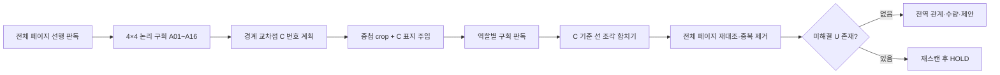

# ESA 도면 구획 연속성·통합 복구 상세 설계

- 상태: **검토 요청안**
- 기준일: 2026-07-23
- 대상: ESA 도면 V3 전체 페이지·정밀 구획·전역 합산 경로
- 기준 리비전: `9d49f8b` + 로컬 dirty snapshot
- [근거] E1 실측 · 공개 도면 6종, KIMM 83페이지 계열, 현재 4/9/16분할 코드
- 상위 정본: `2026-07-21-sld-full-reading-proposal-95-design.md`

## 1. 결론

현재 16분할은 픽셀을 겹쳐 잘라 좌표를 원본으로 되돌릴 뿐, 잘린 선의 신원을 보존하지 않는다. 따라서 같은 전기 선로가 인접 구획에서 서로 다른 선으로 생성되거나, 한 구획에 나타난 여러 절단선이 임의로 연결될 수 있다.

이를 다음 구조로 교체한다.

1. 전체 페이지의 선 구조를 먼저 읽는다.
2. 4×4 **논리 구획** `P01-A01`~`P01-A16`을 만든다. `A`는 분석 창이며 물리 기기나 수량 항목이 아니다.
3. 전체 페이지 선과 논리 경계의 모든 교차점에 **연속 포트** `P01-C001`…을 결정론적으로 부여한다.
4. 실제 crop은 기존처럼 중첩하되, 논리 경계와 `C` 표지를 crop에 주입한다.
5. 구획별 선은 반드시 기기·`C`·미해결 종단 `U` 중 하나를 종단 앵커로 보고한다.
6. 전역 합산기가 같은 `C`를 가진 인접 선 조각만 합친다. 합친 뒤 `C`는 물리 그래프에서 제거하고 감사 기록에만 남긴다.
7. 전체 페이지를 다시 대조해 중복을 제거하고 전기 논리를 교차 검증한다.
8. 경계가 아닌 곳의 열린 끝, 짝이 없는 `C`, 불일치 접선은 `P01-U001`…로 남겨 재스캔하며, 해소되지 않으면 `HOLD`한다.



## 2. 검토한 접근과 선택

| 접근 | 장점 | 결함 | 판정 |
|---|---|---|---|
| 중첩 crop의 좌표 유사도만으로 병합 | 기존 코드 변경이 작음 | 평행선·다중 절단선·짧은 선에서 오병합, 왜 합쳤는지 설명 불가 | 제외 |
| 각 구획 AI가 독립적으로 연속 번호 생성 | 구현이 단순함 | AI마다 번호가 달라지고 존재하지 않는 번호를 발명할 수 있음 | 제외 |
| **전체 선행 판독 + 결정론적 C 계획 + 허용목록 검증** | 번호 안정성, 감사 가능, 다중 절단선 분리, 실패 시 HOLD 가능 | 호출 단계를 둘로 나누고 crop 표지 렌더러가 필요 | **채택** |

번호는 AI가 만들지 않는다. AI는 입력에 주어진 `C` 허용목록 중 보이는 번호만 반환한다. 목록에 없는 번호는 런타임 스키마가 거부한다.

## 3. 식별자와 의미

| 종류 | 예 | 의미 | 물리 설비 수량 |
|---|---|---|---:|
| 분석 구획 | `P01-A07` | 1페이지 4×4의 7번째 논리 분석 창 | 제외 |
| 기기/심볼 | `P01-S014` | VCB, TR, CT, 조명, 콘센트 등 물리 심볼 | 포함 가능 |
| 선로 | `P01-L022` | 최종 합산된 전력·제어·접지·모선 | 제외 |
| 연속 포트 | `P01-C031` | 논리 구획 경계에서 같은 선의 양쪽을 결박하는 임시 앵커 | **항상 제외** |
| 미해결 종단 | `P01-U004` | 기기·C·정상 종단으로 설명되지 않은 열린 끝 | 제외, HOLD 후보 |
| 관계 | `P01-R018` | 최종 기기↔기기 관계 | 제외 |

`A`, `C`, `U`는 심볼 컬렉션에 넣지 않는다. 특히 `C`를 bus·접점·부품으로 승격하거나 수량에 더하는 경로를 타입과 테스트로 차단한다.

## 4. 구획 모델: 논리 core와 실제 crop 분리

현재 `planAdaptiveBounds()`는 18% 중첩된 실제 crop 경계만 반환한다. 이를 다음 두 경계로 분리한다.

```ts
interface AnalysisRegionPlan {
  id: string;
  displayId: string;          // P01-A07
  pageIndex: number;
  row: number;
  column: number;
  logicalBounds: EvidenceBounds; // 겹치지 않는 4×4 core
  cropBounds: EvidenceBounds;    // 문맥 확보용 18% 중첩 crop
}
```

- 기호 소유권은 중심점이 `logicalBounds`에 있는 구획 하나에만 준다.
- 선은 `logicalBounds` 안의 조각만 결과로 채택하고, `cropBounds - logicalBounds`는 문맥 확인용이다.
- `C` 표지는 실제 crop 바깥 끝이 아니라 **논리 경계**에 놓는다. 중첩 문맥을 유지하면서도 AI가 어디까지를 현재 구획의 선으로 보고해야 하는지 고정한다.
- `A` 라벨과 core 경계는 원본 도면의 기호·문자를 가리지 않는 외곽 밴드/반투명 점선으로 렌더링한다.

## 5. C 연속 포트 계획

### 5.1 입력 우선순위

1. PDF/DXF 벡터 선분
2. 전체 페이지 `connections` 역할의 선 경로
3. 위 둘이 없으면 지역 결과의 양쪽 종단을 이용한 **후보 C**

3번은 자동 확정하지 않는다. 인접 구획·위치·접선·선 종류가 모두 맞고 전체 재스캔에서 재확인될 때만 승격한다. 그렇지 않으면 `U`다.

### 5.2 생성 규칙

`planBoundaryContinuations(page, regionPlans, globalLines)`는 각 polyline 세그먼트와 내부 논리 seam의 교차를 구한다.

- 수직 seam: x=25%, 50%, 75%
- 수평 seam: y=25%, 50%, 75%
- 교차점은 seam 방향, seam 순번, 교차 위치, 원본 선 식별자 순으로 정렬한다.
- 내부 ID는 페이지·양자화 좌표·선 출처 해시로 만들고, 표시 ID는 `P01-C001`부터 순서대로 부여한다.
- 같은 위치의 평행선은 접선과 원본 선 출처가 다르면 별도 `C`다.
- 한 구획에 세 개의 독립 절단선이 있으면 세 개 모두 다른 `C`를 가진다. 같은 구획이라는 이유로 연결하지 않는다.

예:

```text
P01-A07
  segment-1: P01-C031 → P01-C032
  segment-2: P01-C033 → VCB-02
  segment-3: TR-01 → P01-C034
```

### 5.3 경계 특수 사례

- seam과 거의 평행한 선은 교차 포트로 만들지 않고 `SEAM_ALIGNED`로 두 구획에 문맥 제공 후 전역 중복 제거한다.
- 격자 모서리를 통과하는 단일 선은 실제로 진입하는 두 core만 관측한다.
- 격자 모서리의 확인된 분기점은 하나의 `C` 그룹에 3~4개 관측을 허용한다.
- 분기점 증거 없이 동일 `C`가 3회 이상 나타나면 `CONTINUATION_CARDINALITY_CONFLICT`로 HOLD한다.
- 기호가 seam 위에 놓이면 기호 소유권은 중심점과 페이지 읽기 증거로 하나만 선택하고, 양쪽 선은 기호 포트에 직접 연결한다. 기호 내부를 C로 자르지 않는다.

## 6. 데이터 계약

기존 V3 소비자를 깨지 않도록 `continuity`를 선택 필드로 추가하되, 새 분석 결과에는 항상 채운다.

```ts
interface BoundaryContinuation {
  id: string;
  displayId: string;
  pageIndex: number;
  point: Point;
  seams: Array<{ orientation: 'vertical' | 'horizontal'; index: number }>;
  tangent: Point;
  lineKind: LineNode['lineKind'];
  source: 'vector' | 'global-vision' | 'local-candidate';
  status: 'planned' | 'paired' | 'merged' | 'ambiguous' | 'hold';
  observations: ContinuationObservation[];
  evidence: EvidenceRef[];
}

interface ContinuationObservation {
  regionId: string;
  side: 'top' | 'right' | 'bottom' | 'left' | 'corner';
  localLineId?: string;
  point: Point;
  tangent: Point;
  confidence: number;
}

interface UnresolvedEndpoint {
  id: string;
  displayId: string; // P01-U004
  pageIndex: number;
  regionId: string;
  localLineId: string;
  point: Point;
  reason: 'UNKNOWN_CONTINUATION' | 'UNPAIRED_CONTINUATION' |
    'TANGENT_MISMATCH' | 'LINE_KIND_MISMATCH' | 'INTERIOR_OPEN_END';
  attempts: number;
  evidence: EvidenceRef[];
}

interface StitchReceipt {
  continuationIds: string[];
  consumedLocalLineIds: string[];
  outputLineId?: string;
  checks: {
    adjacency: boolean;
    cardinality: boolean;
    distance: boolean;
    tangent: boolean;
    lineKind: boolean;
    globalCorroboration: boolean;
  };
  status: 'merged' | 'hold';
}
```

구획 `connections` 출력에는 `startAnchorId`와 `endAnchorId`를 추가한다. 값은 해당 구획 manifest의 기기 ID 또는 `C` ID만 허용한다. 알 수 없는 종단은 ID를 발명하지 않고 `null`과 `openEndReason`을 반환한다.

## 7. 역할별 호출과 실제 호출 순서

현재 council은 전체 페이지와 구획 호출을 한 번에 병렬 실행한다. C 표지를 만들려면 다음처럼 두 단계로 바꾼다.

### Phase 1 — 전체 조사

- `symbols`: 전체 기호 후보와 포트
- `connections`: 전체 선 경로·분기·교차
- `text`: 전체 문자와 도면/표/주석 구역 후보
- `logic`: 아직 결론을 만들지 않고 전원 방향·전압 영역 후보만 생성

Phase 1의 벡터/선 결과로 `A`와 `C` manifest를 만든다.

### Phase 2 — 표지된 구획 독립 심사

- `symbols`: core 안 기호만, C를 기기로 해석 금지
- `connections`: core 안 선 조각과 허용된 종단 앵커만
- `text`: core 안 문자만, 주석 문장과 기기 태그를 분리
- `layout` 전용 역할: 페이지가 평면도일 때 조명·콘센트·스위치·홈런·패널 참조를 판독

마지막에 `coverage-auditor`가 전체 페이지, 구획 완료 원장, C/U 현황을 함께 보고 누락을 지적한다. 기존 최대 55회는 “전체 호출을 먼저 완료한 후 구획 호출”로 순서만 바꾸면 유지할 수 있다. 평면도 역할이 추가되면 별도 예산 상한과 문서 유형별 역할 선택이 필요하다.

## 8. 합치기와 전체 재대조

`stitchBoundaryLines()`는 같은 C 번호라는 이유만으로 바로 합치지 않고 다음을 모두 검사한다.

1. 두 구획이 논리적으로 인접한다.
2. 일반 교차는 관측이 정확히 2개다.
3. 두 관측점이 seam 허용오차 안이다.
4. 양쪽 접선 방향의 절댓값 cosine이 기준 이상이다.
5. 선 종류가 같거나 한쪽만 `unknown`이다.
6. 전체 페이지 선 또는 벡터 선이 같은 통과를 지지한다.

통과하면 중첩 구간을 잘라 한 polyline으로 합치고, local line ID를 `StitchReceipt`에 남긴다. 최종 `LineNode`와 `RelationEdge`에는 C가 남지 않는다.

모든 구획 합산 뒤 전체 페이지를 다시 보고 다음을 수행한다.

- 동일 기호·텍스트·선 중복 제거
- 표 격자·도면틀·건축 벽선을 전기 선로에서 제외
- synthetic junction을 물리 설비 수량에서 제외
- 전원→보호→변압→부하 논리와 공간 그래프 교차 검증
- 같은 설비를 여러 구획이 읽은 경우 근거는 모두 보존하되 개체는 하나로 유지

## 9. U 미해결 종단과 실패 정책

다음은 즉시 추측하지 않고 `U`로 만든다.

- 논리 seam에 닿았지만 manifest에 C가 없음
- C가 한쪽 구획에서만 보고됨
- C 양쪽 접선 또는 선 종류가 불일치
- 구획 내부에서 기기·정상 off-page 참조 없이 선이 끝남
- 모델이 허용목록에 없는 C를 반환함

처리 순서:

1. 해당 seam 양쪽 구획의 `connections`만 1회 재스캔
2. 전체 페이지 `connections`와 대조
3. 벡터 증거가 있으면 대조
4. 해소되지 않으면 `LINE_CONTINUITY_UNCERTAIN`/신규 세부 reason으로 `HOLD`

`U`가 남은 페이지는 `COMPLETE`가 될 수 없으며, 미확정 선을 이용한 공학 제안은 `SUPPORTED`가 될 수 없다.

## 10. 기존 미진행 결함과 통합 순서

### P0-A. PDF 렌더 자산 복구

`drawing-source.ts`의 두 `getDocument()` 호출에 배포 가능한 `wasmUrl`, `standardFontDataUrl`, CMap/JBIG2 fallback 경로를 결박한다. 빌드 시 자산을 `public/vendor/pdfjs/`로 복사하고 존재·해시를 검사한다. ERIC-40/41에서 이미지 픽셀이 실제 렌더되며 관련 경고가 0인지 확인한 뒤 Vision으로 넘긴다.

### P0-B. 구획 연속성

본 문서의 A/C/U 계약, 표지 crop, 단계형 council, stitcher, 전체 재대조를 구현한다.

### P0-C. 복합 시트와 합성 접점 격리

`A` 분석 구획 자체를 “도면/비도면”으로 단정하지 않는다. 별도의 `contentZone`이 SLD·평면도·표·주석·도면틀을 분류하며, 확정된 표/도면틀 선만 결선 후보에서 제외한다. synthetic junction은 관계 보조로만 유지하고 설비 수량에서 제외한다.

### P1-A. 주석 문장 게이트와 평면도 역할

장치 키워드가 문장 안에 있다는 이유로 장치로 만들지 않는다. 평면도는 SLD 심볼 어휘가 아니라 조명·콘센트·GFCI·스위치·분기회로·홈런·패널 참조 어휘로 분석한다.

### P1-B. 스캔 자동 복구

선분 0, 저대비, 흐림, 작은 글자 조건이면 비생성 업스케일·deskew·대비/선 강화 변형을 만들고 전체→구획 Vision으로 자동 라우팅한다. 변형은 원본 좌표 역변환을 반드시 가진다.

### P1-C. 지표 명칭과 테스트 키 하네스

`evidenceTraceRate`를 정확도/완독률과 분리 표기한다. 테스트 키는 요청 메모리에서만 사용하고 로그·결과·Git에 남기지 않으며 공개 6종 반복 실행이 가능해야 한다.

## 11. 설계 시뮬레이션

### 11.1 결정론적 기하 시나리오

| 시나리오 | 입력 | 기대 |
|---|---|---|
| 단일 수평선 | A07→A08 seam 1회 통과 | 동일 C 2관측, 최종 L 1개 |
| 한 구획의 독립 절단선 3개 | A07에 좌우·상단 절단 혼재 | 서로 다른 C 3~6개, 임의 연결 0 |
| 평행선 2개 | 같은 seam 근접 통과 | C 두 쌍, 상호 오병합 0 |
| 격자 모서리 대각선 | 정확히 교점 통과 | 실제 진입 core만 관측, 중복 C 0 |
| 격자 모서리 분기 | 확인된 T/십자 분기 | 3~4관측 허용, junction 유지 |
| seam 위 VCB | 기호 중심이 seam 근접 | 기호 1개, C를 기호 내부에 만들지 않음 |
| 한쪽 C 누락 | A07만 C031 보고 | U 생성, 재스캔, 미해결 시 HOLD |
| 가짜 C | 모델이 C999 반환 | 스키마 거부, 자동 병합 0 |
| 내부 단선 | core 중앙에서 선 끝 | U 생성, 관계 추측 0 |
| seam 평행선 | seam을 따라 선 진행 | SEAM_ALIGNED, 좌표 중복 제거로 L 1개 |

### 11.2 통합 자료 시뮬레이션

| 자료층 | 목표 결함 | 필수 관측 |
|---|---|---|
| 합성 4×4 골든 | C 계획·stitch 정확성 | C precision/recall 1.00, 오병합 0 |
| UM-MCC | 단순 벡터 SLD | 실제 장치·관계 복원, synthetic junction 수량 0 |
| UM-SUB | 고밀도 주석·SLD | 주석 문장 장치 승격 0, 선 연속성 유지 |
| SLO-E2 | SLD+스케줄 복합 | 표 격자 결선 제외, SLD 구역 관계 보존 |
| SLO-E4 | 전기 평면도 | 조명·콘센트·스위치·홈런·패널 관계 출력 |
| ERIC-40/41 | JBIG2 저해상도 스캔 | 렌더 경고 0, 픽셀 실재, 자동 전처리·구획 경로 진입 |
| KIMM 83p 대표층 | 초·중·고·표·회전 | 기존 양성 검출 유지, 표 환각·회전 결속 회귀 방지 |

이 표의 합성 입력은 알고리즘 단위 반증용이며, 공개 도면 정확도 실증을 대체하지 않는다. 공개·KIMM 층은 고정 라벨과 production 호출 결과를 직접 비교한다.

### 11.3 설계 기하 시뮬레이션 영수증

검토안 작성 중 1600×1200 페이지의 4×4 seam과 직선 6개를 이용해 일회성 결정론 시뮬레이션을 실행했다.

- 원시 seam 교차: 18개
- 모서리의 수직·수평 중복을 같은 선·같은 좌표로 묶은 고유 C: 15개
- 수직·수평 seam을 동시에 가진 모서리 C 그룹: 3개
- 15px 떨어진 평행선 두 개의 C: 각각 3개, 합계 6개로 분리
- seam을 만나지 않는 내부 열린 선: `interior-open` 1개로 식별
- 실행 종료 코드: 0

이 실행에서 단일 `seam` 필드로는 모서리 C를 표현할 수 없음을 확인해 계약을 `seams[]`로 수정했다. 아직 production 모듈과 실제 Vision을 사용한 검증은 아니므로 증거 등급은 V0 설계 시뮬레이션이며, 구현 완료나 정확도 PASS로 사용하지 않는다.

## 12. 수용 기준

### A/C/U 계약

- `AC-C01`: 4×4에서 `Pxx-A01`~`A16`이 행 우선으로 안정 생성된다.
- `AC-C02`: 모든 논리 seam 교차가 고유 C를 가지며 인접 crop에 같은 ID로 표시된다.
- `AC-C03`: 같은 구획의 여러 절단선은 별도 C를 가지며 구획 공존만으로 연결되지 않는다.
- `AC-C04`: 허용목록 밖 C는 거부된다.
- `AC-C05`: 일반 C는 2관측, 확인된 모서리 junction만 3~4관측을 허용한다.
- `AC-C06`: 거리·접선·선 종류·전체 근거 중 하나라도 충돌하면 병합하지 않는다.
- `AC-C07`: 합산 후 C는 물리 그래프·설비 수량·최종 관계 종단에 남지 않는다.
- `AC-C08`: 열린 끝은 U로 추적되고 미해결 U가 있으면 COMPLETE를 금지한다.
- `AC-C09`: 전체 재대조 후 local 조각과 최종 L/R 사이 StitchReceipt가 남는다.
- `AC-C10`: 사용자 UI에서 A/C/U와 최종 S/L/R을 선택해 원본 근거로 이동할 수 있다.

### 기존 결함 통합 게이트

- PDF.js 렌더 필수 자산 누락 경고 0, ERIC 대표 페이지의 유효 픽셀/이미지 연산 존재
- synthetic junction의 `physicalEquipmentCount` 기여 0
- 표 적대 입력의 장치·결선 발명 0
- 주석 문장의 장치 승격 0
- 평면도 전용 항목이 SLD 수량과 분리
- 저품질 스캔이 전처리와 Vision 경로에 실제 진입
- `evidenceTraceRate`를 정확도나 95% 배지로 표시하지 않음

### 95% 표시

- 합성 기하층은 exact 100%를 요구한다.
- 공개/KIMM 라벨층은 기호 macro-F1, 텍스트 필드 정확도, C endpoint F1, 최종 relation edge F1, junction 정확도를 각각 측정한다.
- 모든 필수 층·지표가 0.95 이상이고 production fingerprint·서명 영수증이 맞을 때만 `verified95=true`다.
- 라벨이 없거나 Gemini production 호출이 실행되지 않은 자료는 `Not Yet`이며 평균으로 덮지 않는다.

## 13. 구현 경계

새 책임은 대형 오케스트레이터에 직접 몰아넣지 않는다.

| 모듈 | 책임 |
|---|---|
| `analysis-region-planner.ts` | logical core·overlap crop·A ID |
| `boundary-continuation-planner.ts` | seam 교차·C manifest |
| `annotated-region-renderer.ts` | A/core/C 표지 crop |
| `boundary-line-stitcher.ts` | C 검증·선 조각 합치기·receipt |
| `unresolved-endpoint-register.ts` | U 번호·재스캔·HOLD |
| `pdfjs-assets.ts` | 서버/빌드 PDF.js 자산 경로 정본 |
| `content-zone-classifier.ts` | SLD·평면도·표·주석·도면틀 구역 |
| `scan-preprocessor.ts` | deskew·대비·비생성 확대·역변환 |
| `document-orchestrator.ts` | 위 모듈의 단계·예산·상태만 조정 |

## 14. 비목표와 안전선

- C 번호만 맞는다는 이유로 전기적 연결을 확정하지 않는다.
- 구획 A를 도면 객체나 부품으로 취급하지 않는다.
- 표/주석 분류가 모호하면 내용을 버리지 않고 `mixed/unknown`으로 유지한다.
- 업스케일은 판독 보조일 뿐 없는 글자·선을 생성하지 않는다.
- 95%는 설계 목표이며, 시뮬레이션만으로 달성했다고 보고하지 않는다.
- 회사별 태그명은 사전 확장 포인트로 두되 IEC/KS 공통 심볼·기본 전기 논리를 정본으로 한다.

## 15. 검토 시 확인할 결정

본 설계의 핵심 결정은 다음 세 가지다.

1. `A`는 분석 구획, `C`는 임시 연속 포트, `U`는 미해결 종단으로 분리한다.
2. 전체 페이지 선행 판독이 끝난 뒤 C를 주입하고 구획 판독을 시작한다.
3. C 결박 뒤에도 전체 페이지 재대조를 통과해야 최종 관계를 확정한다.

이 세 결정을 승인하면 별도 구현 계획의 RED 테스트부터 진행한다.
